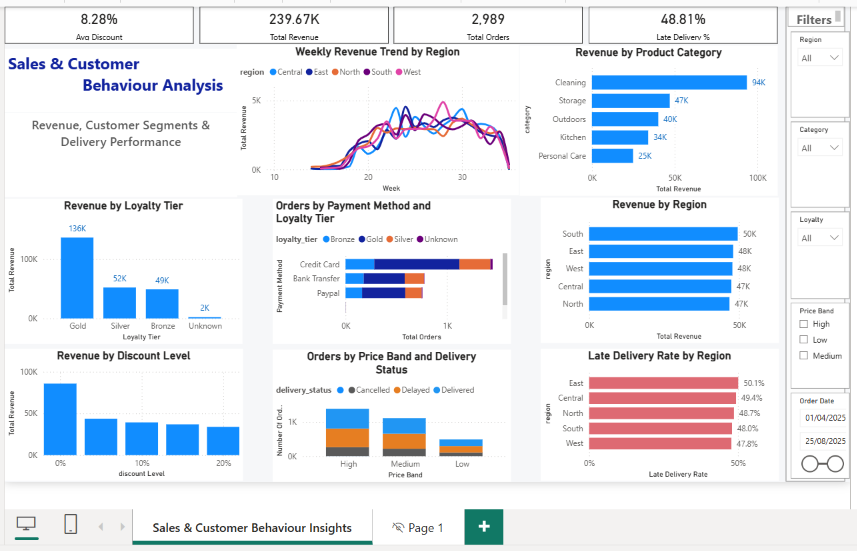

# 🛒 Green Cart – E-commerce Sales & Delivery Analysis

## 📌 Project Overview

Green Cart is an e-commerce sales analytics project developed in Power BI to analyse business performance across revenue, customer loyalty, product categories, discount levels, regional performance and delivery operations.

The objective of the project is to transform transactional sales data into an interactive business intelligence dashboard that helps decision-makers understand:

- Overall sales and order performance
- Customer behaviour across loyalty tiers
- Revenue contribution by product category and region
- The relationship between discount levels and revenue
- Delivery performance across regions

The project also places a strong emphasis on data validation to ensure that KPIs and business insights are supported by the underlying data.

## 🎯 Business Questions

This analysis was designed to answer the following business questions:

- Which product categories generate the most revenue?
- How does revenue vary across regions and over time?
- Which loyalty tiers contribute the most revenue and orders?
- How does revenue performance vary across different discount levels?
- Are delivery delays concentrated in particular regions or widespread across the business?
- How does delivery status vary across different product price bands?

## 📊 Dashboard Preview



### Key KPIs

| KPI | Result |
|---|---:|
| 💰 Total Revenue | £239.67K |
| 🛒 Total Orders | 2,989 |
| 🏷️ Average Discount | 8.28% |
| 🚚 Late Delivery Rate | 48.81% |

## 🛠️ Tools & Technologies

- **Power BI** – Dashboard development and interactive data visualisation
- **Power Query** – Data cleaning and transformation
- **DAX** – KPI and business measure development
- **Data Modelling** – Star-schema design and relationship management
- **Excel** – Data review and validation

## 🧹 Data Preparation & Transformation

Before building the dashboard, the dataset was prepared and validated to improve reporting accuracy and consistency.

Key preparation steps included:

- Reviewed and corrected data types
- Checked for duplicate records and missing values
- Standardised categorical fields such as delivery status and loyalty tier
- Prepared date fields for time-based analysis
- Created analytical fields including order week and price band
- Validated key fields before developing dashboard measures

## 🗂️ Data Modelling

The data was structured for analysis using a **star-schema approach**, separating transactional sales data from descriptive dimensions.

This modelling approach helped:

- Simplify relationships between tables
- Improve filtering and aggregation
- Support reusable DAX measures
- Make the Power BI model easier to maintain and analyse

## 🧮 Key DAX Measures

The dashboard uses DAX measures to calculate core business KPIs dynamically within the current filter context.

### Total Revenue

```DAX
Total Revenue =
SUM(fact_sales[revenue])
```

### Total Orders

```DAX
Total Orders =
DISTINCTCOUNT(fact_sales[order_id])
```

### Average Discount

```DAX
Avg Discount =
AVERAGE(fact_sales[discount_applied])
```

### Late Delivery Rate

```DAX
Late Delivery % =
DIVIDE(
    CALCULATE(
        COUNTROWS(fact_sales),
        fact_sales[delivery_status] = "Delayed"
    ),
    CALCULATE(
        COUNTROWS(fact_sales),
        fact_sales[delivery_status] IN {"Delayed", "Delivered"}
    ),
    0
)
```

The late delivery calculation excludes cancelled transactions from the denominator, so the KPI measures delayed deliveries against orders with a completed delivery outcome.

## 🔍 Key Insights

### 🏆 Loyalty Tier Performance
- Gold customers generated approximately **£136.4K in revenue**, representing around **57% of total revenue**.
- Gold also accounted for approximately **56% of total orders**.
- Revenue per order was only moderately higher for Gold than Silver and Bronze, suggesting that Gold's revenue leadership was primarily **volume-driven**.

### 📦 Product Category Performance
- **Cleaning** was the highest-revenue category, generating approximately **£93.6K**, or **39% of total revenue**.
- Its strong performance was primarily driven by high order volume.
- **Kitchen** generated the highest revenue per order at approximately **£84.35**, showing that the highest-volume category is not necessarily the highest-value category per order.

### 🏷️ Discount Analysis
- Among discounted orders, order volumes were broadly similar across the **5%–20% discount levels**.
- Revenue declined as the discount level increased, with revenue per order also falling at deeper discount levels.
- This suggests that deeper discounts should be evaluated carefully against their impact on sales volume and overall revenue performance.

### 🚚 Delivery Performance
- The overall late delivery rate was **48.81%**.
- Regional late delivery rates ranged from approximately **47.8% to 50.1%**.
- Because the rates were consistently high across all regions, delivery delays appear to be a **business-wide operational issue** rather than a problem isolated to one region.

 ## 💡 Business Recommendations

Based on the analysis, the following actions could be considered:

- **Investigate delivery operations:** With late delivery rates close to 50% across all regions, review fulfilment, dispatch and delivery processes to identify common causes of delay.
- **Strengthen Gold customer engagement:** Gold customers generate the majority of revenue and orders, making retention and continued engagement of this segment commercially important.
- **Review deeper discount strategies:** Evaluate whether higher discount levels generate sufficient additional demand to compensate for lower revenue per order.
- **Apply category-specific strategies:** Cleaning is the strongest category by total revenue and order volume, while Kitchen generates higher revenue per order. These categories may therefore require different commercial strategies.
- **Monitor regional performance collectively:** Since both revenue and delivery performance are relatively balanced across regions, operational improvements should initially focus on business-wide processes rather than a single region.

## ✅ Data Validation

Data validation was performed throughout the project to ensure that dashboard results were consistent with the underlying data.

Validation included:

- Checking KPI totals against the underlying dataset
- Reviewing order counts using distinct Order IDs
- Comparing revenue and order volumes across loyalty tiers, categories, discount levels and regions
- Investigating unusually high or low results before interpreting them as business insights
- Reviewing filter context to ensure dashboard selections did not unintentionally affect validation results

This validation process helped ensure that the final dashboard communicated reliable and defensible business insights.

## 🎯 Skills Demonstrated

- Power BI dashboard development
- Power Query data cleaning and transformation
- DAX measure development
- Star-schema data modelling
- KPI design and validation
- Data visualisation and dashboard storytelling
- Customer and sales analysis
- Operational performance analysis
- Data quality assurance
- Translating analytical findings into business recommendations

## 📁 Project Files

| File | Description |
|---|---|
| `Green-Cart-Power-BI-Dashboard.pbix` | Complete interactive Power BI report |
| `Green-Cart-Dashboard.png` | Final dashboard preview |
| `README.md` | Project documentation and analytical case study |

## 👤 Author

**Susmita Mondal**  
Data Analyst | Power BI Developer

**LinkedIn:** [Susmita Mondal](https://www.linkedin.com/in/susmita-mondal-51853999/)

**GitHub:** [SusmitaMon](https://github.com/SusmitaMon)

